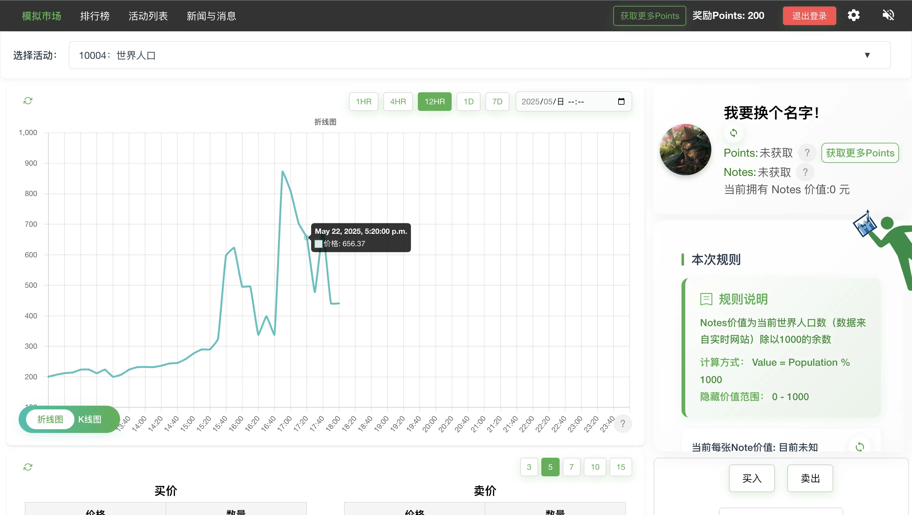

# TradeULike 交易客
一个使用特殊规则模拟股市、并与真实用户交易的社区。

## 使用/运行
请前往[tradeulike.com](https://tradeulike.com)使用

## 简介
- 真人参与
参与者均为真实用户，拒绝历史数据和虚拟数据，体验真正的市场博弈。

- 创新玩法
交易物的最终价值由可分析但不可预测的规则决定，活动结束前无人知晓结果。

- 比赛房间
想要用模拟市场支持您的教学、研究或活动？您可以在我们的网站创建比赛房间。

[活动页面](https://tradeulike.com/event) [活动列表页面](https://tradeulike.com/eventlist) [公告页面](https://tradeulike.com/news)

## 详细介绍
在某所大学的课堂上，教授让每位学生报出一个0到100之间的数字。最终，报出的数字最接近“全班平均值的一半”的同学，将获得100美元奖励。显而易见，平均值大约是50，那么一半就是25。但如果每个人都这么想，大家都会报25左右，平均值的一半又会变成12.5。继续推理下去，合理的数字会不断降低，最终趋近于0。但在真实市场中，每个人的理性程度不同，没有人能完全预测他人的选择，在这个课堂上，又有多少人真的会选择报出0这个数字呢。

股市、债券、通货、加密货币，很多市场都有这样的特点：在完全理性的环境下，价格和市场变化是可分析可推导的，但实际市场中，所有的结果都是不可预测的。

我们使用一种新颖的方式设计交易，模拟股市、债券、通货、加密货币等市场：
规则导向：使用和上面实验中类似的可分析而不可预测的规则来为市场中的价值卷定价。
真人玩家参与：在特殊的规则导向下，我们的网站不像其他模拟交易网站一样使用历史数据或模拟数据，你的每一笔买卖将真正地影响市场。
股市模拟：买单、卖单、市价单、历史K线、折线图、K线图...，应有尽有，更多的功能还在一步步上线。

## 更多功能

- 多样比赛，不同规则
- 丰厚奖金，等你来拿
- 收藏感兴趣的活动

- 排名系统
- 比赛过程中实时更新匿名数据
- 获取奖励Points

- 私人房间，支持教学/研究或私人活动
- 与好友一起参与

- 创建属于自己的房间
- 为新的活动提出建议

- 新闻与消息
- 更新通知
- 公告与留言板

- 使用奖励Points换取活动Points
- 邀请好友获取奖励Points

## 联系我们
微信号：tradeulike
邮箱：tradeulike@gmail.com